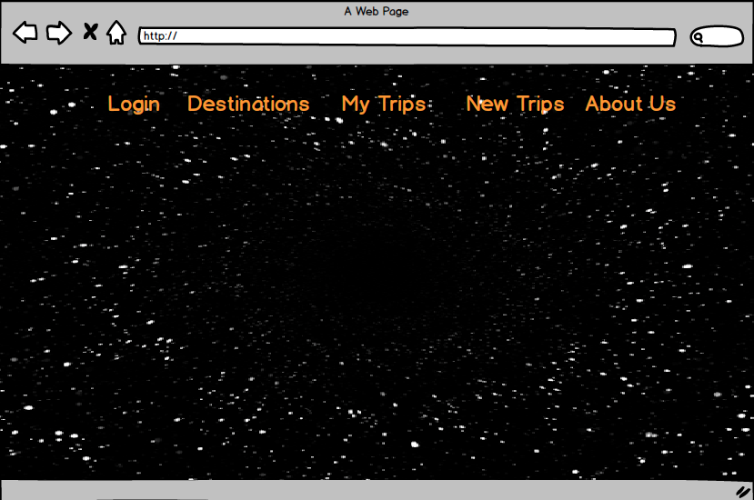

# Project 2 - G.I.T.S
- Galactic Interplanetary Travel Systems

By:
  - Blake Harris   
  - Avery-Dante Hinds
  - Colin Daniel

### Technologies

- HTML5
- CSS3
- JavaScript
- MongoDB
- Node.js
- bcryptjs
- Body-Parser
- Ejs
- Express
- Express-session
- Method-override
- Mongoose
- Mongoose-unique-validator

### User Stories

- Should be intoduced by a landing page
- Landing page should contain links to Login/New Trip/Our Destinations/My Trips/About Us
- Clicking on Destinations will give you a list of the destinations (Planets/Moons) we travel to
- Clicking on About Us should take you to a page with our company info 
- Clicking on Login with allow you to login with Google or if you have an account, otherwise it will allow you to create one. 
- Clicking on My Trips will allow you to see all the trips that have been booked by that user. If the user is not logged in then it will redirect to the login page
- Clicking on New Trip will render the trip/new.ejs and create a new trip for the user if they alread know wher they want to go
- For each destination, there will be a show page that displays information about the location
- From that show page, user will be able to click "Book a Trip" and it render you to trip/new.ejs file and allow you to book it there.
- Once a trip is booked, user will then find their booked trip in "My Trips", which will give them information based on the flight
- In "My Trips" they should be able edit their name, amount of tickets, destination, or just delete thier trip.

### Struggles 

- Mongoose-unique-validator
- Req.Sessions Login validation 
- Calculating the escape velocity from Ganymede with a payload of 100 humans
- Redirecting from google authentication back to localhost
- Passport.use middleware logging to the terminal
- Git Merging
- Deploying on Heroku 

